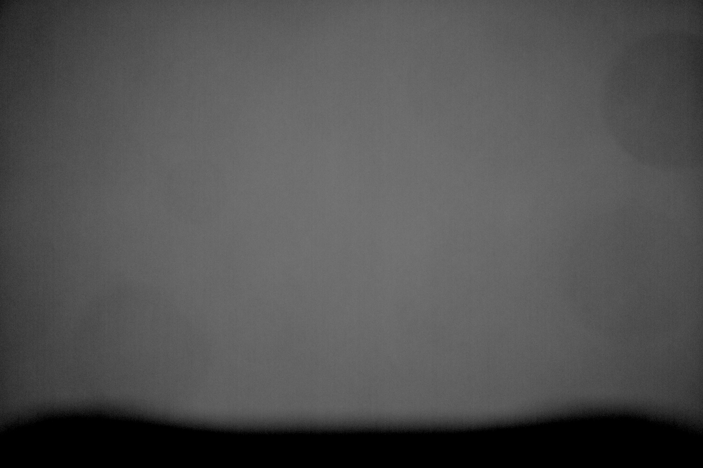

Telescope: William Optics Fluorostar 91 w/ Flat 6A III
Mount: Sky-Watcher EQ6-R Pro
Camera: ZWO ASI2600MM Pro
Filter Wheel: ZWO EFW 7x36mm
- ZWO Premium L 36mm unmounted
- ZWO Premium R 36mm unmounted
- ZWO Premium G 36mm unmounted
- ZWO Premium B 36mm unmounted
- ZWO H-a 7nm 36mm unmounted
- ZWO O-III 7nm 36mm unmounted
- ZWO S-II 7nm 36mm unmounted
Guiding: ZWO OAG-L with ZWO ASI290MM Mini

<!--more-->

Not terrible for a first attempt!
The prisim of the off-axis guider is intruding onto the image sensor, this will be fixed in the next imaging series.
There is also quite a lot of dust on the filters already so I'm looking forward to cleaning them.
