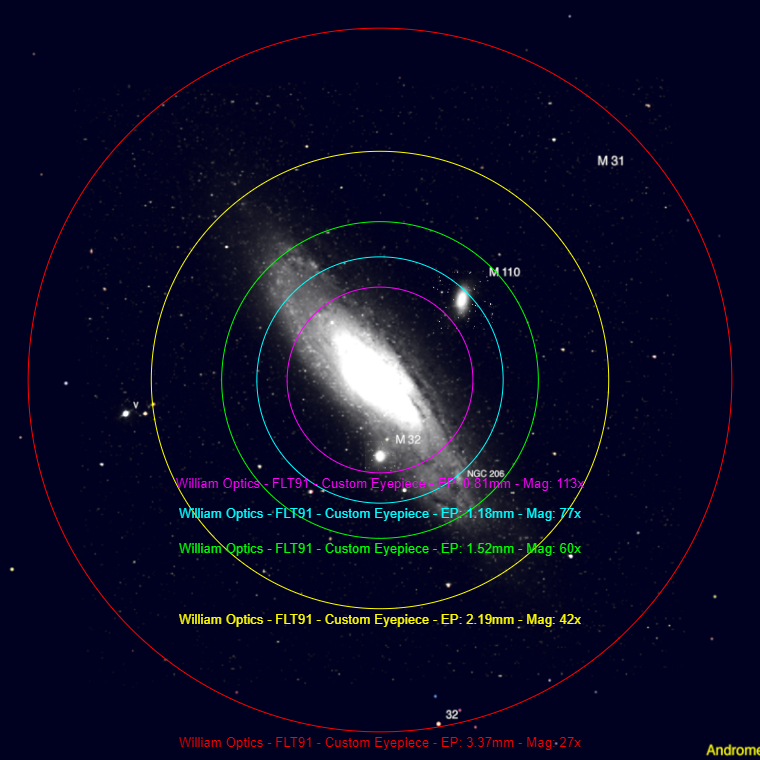

+++
title = "Astro Tech XWA Eyepiece Review"
date = "2022-03-28"
description = ""
tags = [
    "astrophotography",
    "equipment",
    "eyepieces",
    "reviews",
]
categories = [
    "astrophotography",
]
featureImage = "astrotech-xwa.jpg"
draft = true
+++

Clone of:
APM XWA Hyperwide
Stellarvue Optimus 

Very large about 3 inch diameter and 6.25 inches long.

About 50% more area than 82 degree ep

Multicoated lenses with blackened edges

O-ring seal
- prevent fogging
- prevent dust accumulation
- easier cleaning

May vignette for glasses wearers but the field is so wide you have to move your head around anyway

All come with screw on 2 inch collar

<!--more-->

| Focal Length | Eye Relief | FoV  | Weight | Elements | Barrel    | Magnification | Exit Pupil |
|--------------|------------|------|--------|----------|-----------|---------------|------------|
| 4.8 mm       | 15 mm      | 110° | 19 oz  | 8        | 1.25/2 in | 113x          | 0.8 mm     |
| 7 mm         | 15 mm      | 100° | 17 oz  | 8        | 1.25/2 in | 77x           | 1.2 mm     |
| 9 mm         | 15 mm      | 100° | 17 oz  | 9        | 1.25/2 in | 60x           | 1.5 mm     |
| 13 mm        | 15 mm      | 100° | 19 oz  | 9        | 1.25/2 in | 42x           | 2.2 mm     |
| 20 mm        | 15 mm      | 100° | 24 oz  | 9        | 2 in      | 27x           | 3.4 mm     |
