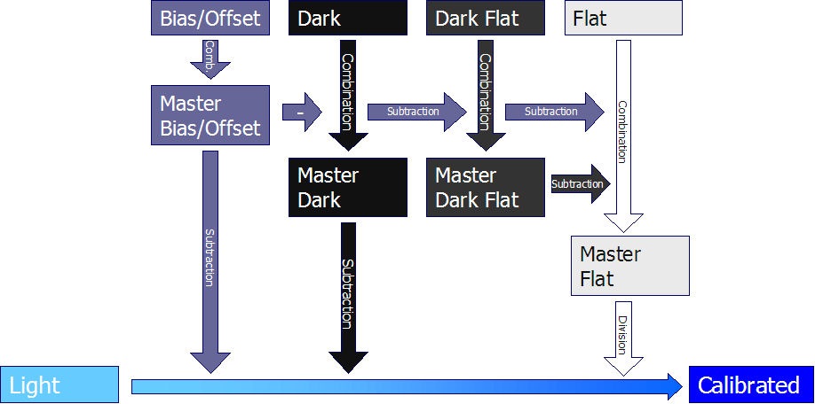

+++
title = "Astrophotography Calibration Frames"
date = "2022-04-10"
description = ""
tags = [
    "astrophotography",
]
categories = [
    "astrophotography",
]
series = ["Learning Astrophotography"]
featureImage = "calibration.jpg"
draft = true
+++

Blah

<!--more-->

## Bias Frames

Electrical read out noise

Put lens cap on and take shortest exposure possible, take a bunch of pictures, stack them.

Reusable so take 50-100.

## Dark Frames

Electrical noise during a real exposure (Temperature, exposure time, and ISO dependent)
Take care of hot/cold/dead pixels.
Also include the readout noise (bias frames)

Put lens cap on and set temperature, exposure and ISO to match your light frames. If you don't have a temperature controlled camera, capture these after you are done taking lights.

Reusable if you have a temperature controlled sensors. Take 20-50.

## Flat Frames

Compensates for dust and vignetting
Do nothing for light pollution

Don't change rotation or focus between flats and lights. Stretch t-shirt or other white cloth of aperture and point telescope at a white laptop screen. Set exposure for halfway of histogram.

Take about 20.

## Dark Flat Frames

Compensate for thermal noise in your flat frames

Put lens cap on and take many exposures with the same settings as your flats.

Take the same number as your flats.

## Tips

Light, dark, and bias frames need to be at the same temperature and ISO.

[DSS Calibration Process](http://deepskystacker.free.fr/english/theory.htm#CalibrationProcess)

## DIY Flat Field Panel

Blah blah blah

[5 inch EL panel source](https://www.ellumiglow.com/electroluminescence/astrophotography/astrophotography-5in-circle-kit)

## My Process

### Bias Frames

NINA: Tempreature, gain, and offset equal to light frames. Exposure 0.0s
Collect 100

### Dark Frames

NINA: Temperature, gain, offset, and exposure time equal to light frames
Collect 40
These can be reused

### Flat Frames

NINA Flat Wizard takes Flats and Dark Flats

### Deep Sky Stacker Masters

Masters are created in the same directory as the source files

### PixInsight

PixInsight scales dark frames by default...

#### Bias and Dark

Add files

Combination method: average

No normalization to prserve bias pedestal

Weights: Don't Care (all weights = 1)

Uncheck evaluate noise

Pixel rejection:
- <7 frames: Percentile clipping
- 7-10 frames: Averaged Sigma Clipping
- 15-25 frames: Winsorized Sigma Clipping
- >25 frames: Linear Fit Clipping
No normalization

Apply global

#### Flats

Calibration
Create a master dark flat for each filter as above.
Load the flat frames in the target frames list.
Select an output directory where to save the calibrated flat frames
Disable the Master Bias section checkbox
Load the master flat dark as master dark
Disable both Calibrate and Optimize in Master dark section
Disable the Master Flat section checkbox
Press the Apply global button

Integration
Load calibrated frames for a single filter
Combination: average
Normalization: multiplicative
Weights: Don't care
Pixel rejection:
- <7 frames: Percentile clipping
- 7-10 frames: Averaged Sigma Clipping
- 15-25 frames: Winsorized Sigma Clipping
- >25 frames: Linear Fit Clipping
Normalization: equalize fluxes
