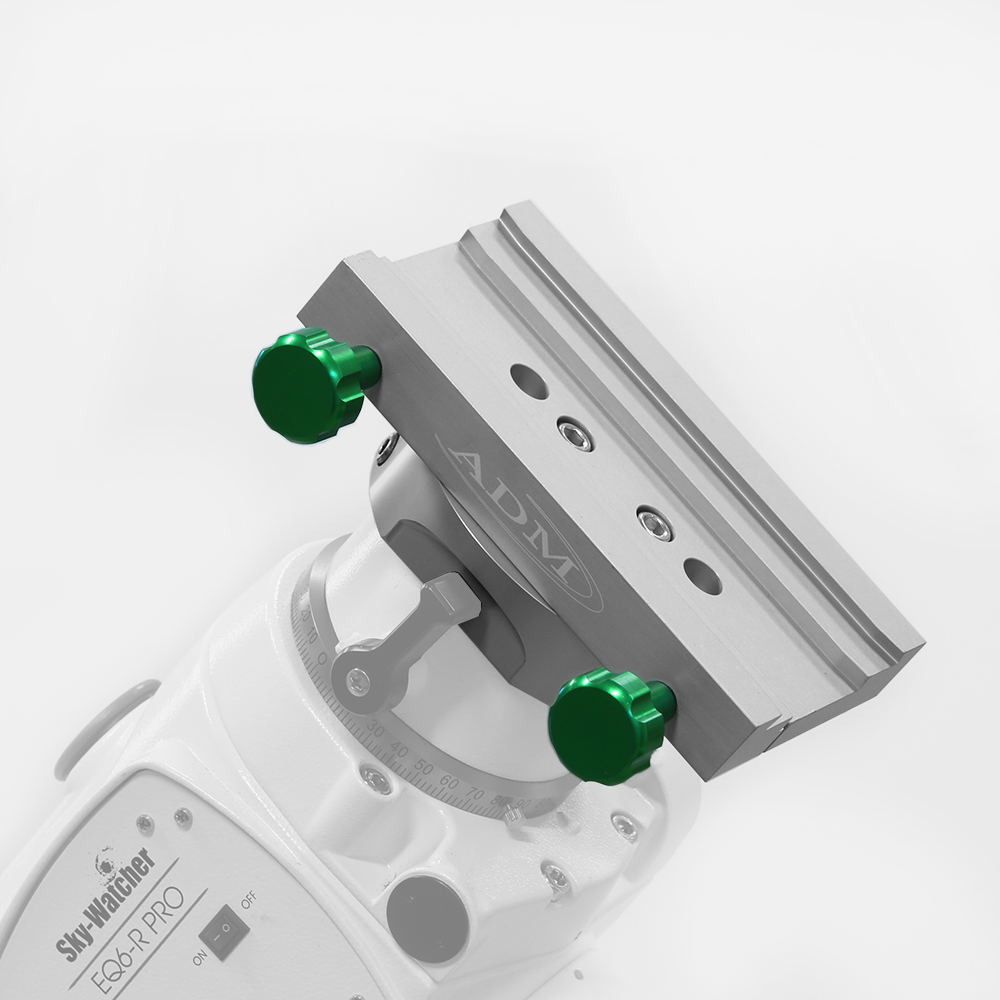

The Sky-Watcher EQ6-R Pro is already an excellent mount out of the box.
It has been routinely delivering 0.5 arcsecond guiding accuracy even with my fairly long refractor onboard.
But there are a few things that are easy to upgrade at home that make the mount even better.
I've outlined what I have done to my mount below from easiest to hardest (accounting for time and money).

## Loosen the RA/Dec bearings (Free)

Out of the box, both the RA and Declination axis were fairly tight.
With the clutches released, neither axis would swing freely when pushed, they would just quickly come to a stop as soon as I stopped pushing.
It is likely that the factory has a fairly relaxed torque specification on the nuts that retain the tapered roller bearings.
This stiction makes getting perfect balance difficult because it is hard to tell if the mount is balanced or stuck.
The stiction also applies extra load to the motors which can slow down guiding corrections. 
Luckily this is an easy (and reversible) fix that requires only a couple of tools and no more than a few minutes.

### Process

Loosen the counterweight shaft retaining knob and use a a 2.5mm hex wrench to back each of the 3 set screws in the counterweight retaining assembly (the white dome that the shaft retaining knob screws into) by a turn or so.
Make sure you release the declination clutch and hold the saddle while trying to loosen the the counterweight retaining assembly by hand.
If you cannot loosen it by hand, a strap wrench (like you might use for a vehicle oil filter) should help.
You want to loosen this only as much as needed to allow the declination axis to spin freely without introducing any up/down slop to the declination axis.
When you're happy, simply tighten up the 3 set screws and the counterweight shaft knob.

For the RA axis you begin by removing the polar scope cover and unscrewing the polar scope from the mount.
Again, if you cannot remove the polar scope by hand, a strap wrench should get the job done.
The silver ring around the polar scope is retained by 2 set screws, one on each side of the mount.
Use a 2mm hex wrench to loosen each screw by a turn or two until the silver ring can be removed from the mount.
You can now see a large black nut that unfortunately has smooth sides.
This nut has 4 set screws around the circumfrence of the nut that need to be loosened using a 2mm hex wrench.
Unlock the RA clutch and attempt to loosen this nut while holding the head of the mount stationary.
If you cannot loosen the nut, a strap wrench will again be helpful.
Even a strap wrench could not loosen the nut on my mount, luckily there are two unthreaded holes on the face of the nut that perfectly fit M4 screws, I could then use a screwdriver shaft like a spanner wrench across the two M4 screws.
Like you did for the declination axis, you only want to loosen this nuts as much as needed to get the axis to spin freely without introduction any slop.
When you're happy, tighten up the 4 set screws and replace the polar scope, the silver ring, tighten those 2 set screws and replace the polar scope cover.

Both axis of your mount should now spin quite freely!
It's hard to be sure because so many things can affect guiding accuracy but it seems like I'm getting closer to 0.3 arcseconds now!

I got this idea from [Explore Learn Share](https://www.youtube.com/watch?v=0yzFTjlpZaI) on YouTube, check out his video if you want to see what this looks like.

## Replace the stock saddle ($200)

The stock saddle works fine for smaller and lighter scopes that typically use a V series dovetail but it does not stay square when used with the larger D series dovetail.
It still "works" but it makes me nervous.
Luckily [ADM](https://www.admaccessories.com/product/dual-eq6-rpro-xl-dual-series-saddle-fits-skywatcher-eq6-orion-atlas-mounts/) makes a lovely CNC machined replacement saddle that fixes this problem and has an overall nicer fit and finish, as well is *much* nicer and larger hand knobs.
For about $200 you can pick this up and install it in about 5 minutes.
It is so easy it doesn't even come with instructions and I'm going to follow their lead!
