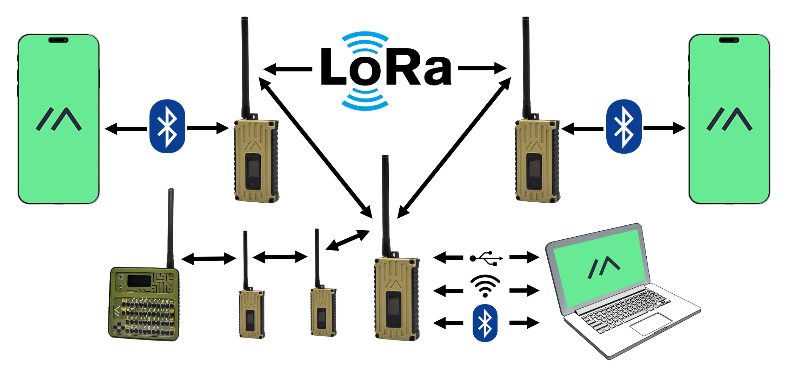

**Insert Lead paragraph here.**

## What is Meshtastic

Meshtastic is an open source project that uses low cost LoRa radios for long range off-grid communications.
LoRa radios are low power devices with an extremely low noise floor that enables long distance communication, generally only limited by line of sight since most radios are at ground level.
In fact, the current documented record is [over 300km](https://meshtastic.org/docs/overview/range-tests/#current-ground-record-331km).

Meshtastic enables these low cost radios to operate as a distributed mesh with no centralized router required.
If another node picks up your traffic, it will forward it along until the maximum hop count is reached.
This all happens in a very ad-hoc manner which allows vehicle mounted nodes to contribute to the existing mesh of fixed nodes to expand coverage.
In fact, people have started carrying a simple node while flying, frequently linking my normally disconnected Iowa network to Minnesota and Illinois.

Meshtastic also enables varying levels of data security.
By default all devices in a given regulatory area share a common channel slot and encryption key, allowing everyone to talk to each other.
You can add your own private channel with unique encryption keys for secure communication while still utilizing the default mesh to expand your coverage.
Any node that shares the same modem preset and channel slot will forward your traffic, even if they cannot decrypt your traffic.
This comes in handy for one of my use cases.

## Meshtastic Use Cases

First and foremost, I'm having fun with this.

## Getting Started With Meshtastic

baz
