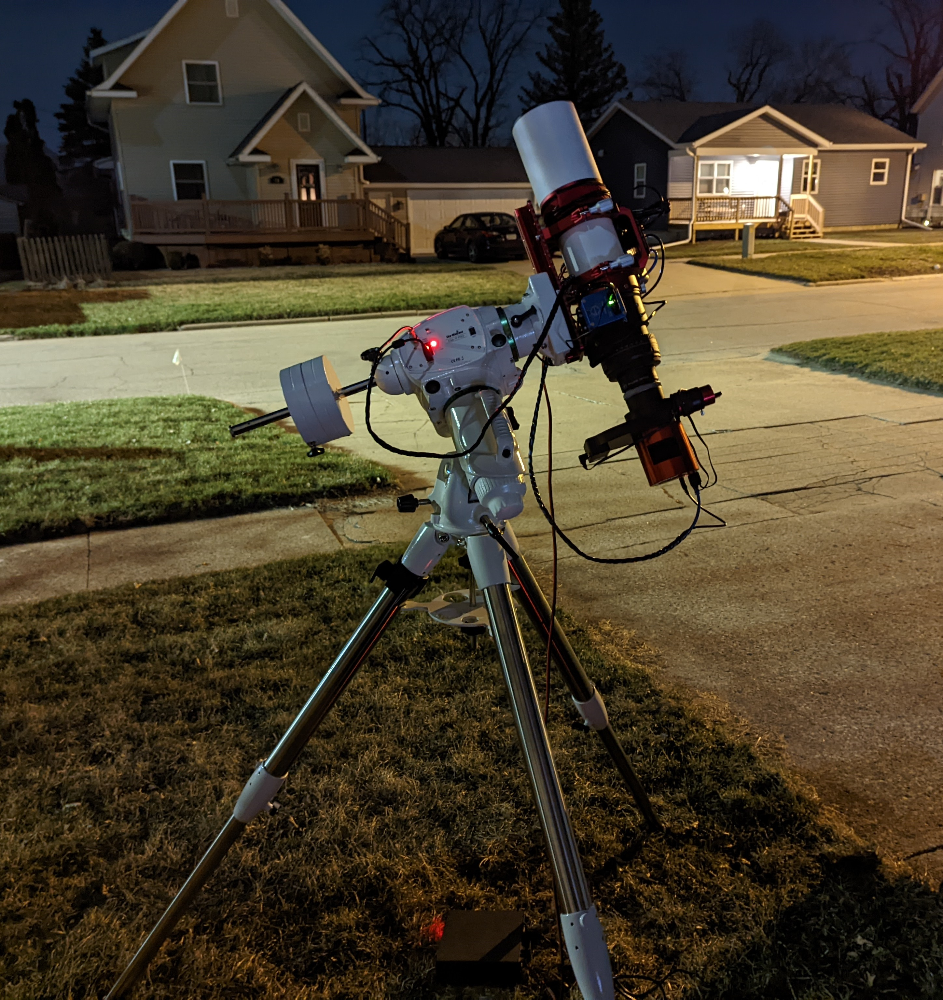

I recently acquired the William Optics Fluorostar 91 as both a visual and imaging telescope.
I selected this model because of the excellent optical quality, large number of included accessories and the avaliability of multiple options of field flatteners from William Optics.
I also wanted a little bit more aperture than your standard 80mm while still staying around 500mm of focal length.

<!--more-->

**Technical Specifications**

- Configuration: Apochromatic Triplet
- Lens Material: STM coated FPL-53
- Objective Diameter: 91mm
- Focal Length: 540mm
- Aperture: f/5.9
- Focuser: Dual speed 3.3" rack and pinion focuser
- Total Weight: 5.575kg

## Impression

The telescope came well packaged in a double thick cardboard box.
In lieu of traditional packaging materials, the telescope is packaged inside a custom soft sided carrying case.

On opening the carrying you immediately notice the prominent aluminum carry handle that doubles as a vixen base for a finder or guide scope.
The carry handle is firmly mated to two stout rings with hand tightenable hardware securing the optical tube in the rings.
The rings are attached to a extra long saddle plate with an extended vixen style rail underneath.
The saddle plate has plenty of mounting options for extra accessories and has slotted holes to reposition the optical tube for balancing.
All the machined components showed no signs of manufacturing defects and had very good surface finish with no blemishes in the anodizing (and the red looks great).

Pulling the telescope out of the carrying case I was pleased not to notice any wiggling of components or sliding of the focuser drawtube or retractable dew shield.
The dust cover was well fitting and lined with a felt like material to prevent any scratching and ensure a light and dust proof fit.
The front of the dust cover unscrews to expose the integrated clear bahtinov mask for diffraction spike assisted focusing.
The dew shield itself slides smoothly on the optical tube and holds it's possition well.

At the rear of the optical tube is the very beefy 3.3" rack and pinion focuser assembly.
The focuser is rotable on the optical tube for easy focusing during visual observing and it has adjustable tension so heavy eyepieces can be compensated for without applying unneeded force.
The focuser wheels are very large, apparently a new addition from William Optics, with the left wheel containing a thermometer and the right wheel having the fine focus knob under a screw on shield.
The end of the focuser drawtube has a field rotator with 1 degree gradations, very handy for repeatable framing from night to night.

## Visual Configuration

In the shipped configuration the telescope is set up for visual observing, with an extension tube leading to the William Optics Rotolock 2" holder.
The Rotolock holder has a very satisfying feel and holds my 2" diagonal very securely while allowing a quick twist to rotate the diagonal after prolonged tracking.
This entire assembly of the extension tube and Rotolock is removed for imaging purposes.

## Imaging Configuration

While the FLT 91 is fairly flat, it does benefit from a field flattener if you are after perfectly flat photographs, especially with larger APS-C or full frame sensors.
Both the Flat 6AIII at 0.8x and the Flat 68III at 1.0x from William Optics are recommended for this scope, however both require an adapter.
The 6A requires the M92-M63 adapter from William Optics in order to mate the flattener to the back of the FLT 91 and requires the adjustable spacer on the flattener be set at 5.4mm.
The 68 requires the M80-M48 adapter to set the correct spacing and reduce the threads down from the flattener as well as setting the adjustable spacer to 5mm.

### Assembling the Flat 6A

1. Remove the visual back assembly consisting of the rotolock adapter and the large extension tube.

2. Mount the M92-M63 adaptor ring onto the threads on the rear of the FLT 91.

3. Unscrew the back half of the 6A flattener until the markins on the threaded barrel read approximately 5.4mm, if you have a pair of calipers you can measure the gap between the locking ring and rear of the flattener.
Tighten the locking ring against the back of the flattener, reverifying the gap measurement with whatever tools you have avaliable to you.

4. Mount the flattener to the M63 threads of the adapter.

5. Mount the rest of your imaging train, ensuring that you have 55m of backfocus from the base of the threads on the flattener.

6. Set the focuser drawtube to 21mm for a good initial focus point.

## Conclusion

So far I'm very pleased with the initial quality of the William Optics Fluorostar 91.
I've read some forum posts about early focuser and tilt issues as well as general quality control issues but I have not seen any of that with my telescope and I have not seen any recent complaints online either.
William Optics has proactively reached out to anyone affects by these issues and promised to revamp their quality control process, that seems to have had a positive effect.
Time and lots of cloud free nights will be needed before I can have a qualitative option, but I'm very hopeful.

## Resources

- [Fluorostar 91 manufacturer page](https://williamoptics.com/fluorostar-91)
- [Flat 6AIII manufacturer page](https://williamoptics.com/products/accessories/barlows-flatteners/2019-all-new-adjustable-flat6aiii-t-mount-not-included)
- [FLT 91 flattener package manufacturer page](https://williamoptics.com/products/accessories/barlows-flatteners/flat6aiii-special-edition-for-flt91)
